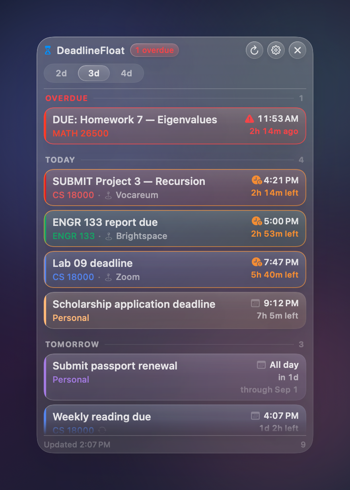

# DeadlineFloat

A small always-on-top macOS window that shows the Google Calendar deadlines you
actually have to do something about — today plus the next two, three or four
calendar days.

Native Swift and SwiftUI, no Electron. Liquid Glass on macOS 26 and later, with a
hand-built glass fallback down to macOS 14. Sign in with Google, read-only
access, tokens in the Keychain, and no network destination other than Google's
own endpoints.

| First run | Light | Dark | Compact |
|---|---|---|---|
|  |  |  |  |

| Settings — General | Settings — Appearance | Settings — Calendars |
|---|---|---|
|  |  |  |

> These images are rendered by the app itself (`--render-screenshots`) over a
> synthetic desktop, using its real views, type and colours. The live Liquid
> Glass material refracts whatever is genuinely behind the window, which an
> offscreen render cannot reproduce, so the previews show the layered
> compatibility glass. Everything else is exactly what the app draws.

---

## Contents

**Using it**
- [Install and sign in](#install-and-sign-in)
- [Launch at Login](#launch-at-login)
- [How it decides what is a deadline](#how-it-decides-what-is-a-deadline)
- [How the date range works](#how-the-date-range-works)
- [Colours](#colours)
- [Privacy and permissions](#privacy-and-permissions)
- [Troubleshooting](#troubleshooting)

**Building and shipping it**
- [Build and run](#build-and-run)
- [The Google OAuth client](#the-google-oauth-client)
- [Build a signed `.app`](#build-a-signed-app)
- [Shipping it to other people](#shipping-it-to-other-people)
- [Project structure](#project-structure)
- [Tests](#tests)
- [Edge cases it handles on purpose](#edge-cases-it-handles-on-purpose)

---

## Install and sign in

1. Drag **DeadlineFloat.app** to `/Applications` and open it.
2. Press **Sign in with Google** in the window.
3. Your browser opens Google's sign-in page. DeadlineFloat never sees your
   password — the browser does the signing in.
4. Google asks to allow one thing: *"See and download any calendar you can access
   using your Google Calendar."* That is the whole request. Press **Continue**.
5. The browser lands on a small confirmation page served by DeadlineFloat's own
   loopback listener, which shuts down immediately. Close the tab.

That is the entire setup. There is nothing to paste and no account to create.

The window fills in straight away. Pick which calendars to include in
**Settings → Calendars**; until you choose, DeadlineFloat follows whichever
calendars are ticked in Google Calendar itself.

There is no Dock icon by design — the control is the **hourglass in the menu
bar**. Left-click toggles the window; right-click gives Show/Hide, Refresh, Reset
Window Position, Launch at Login and Quit.

To disconnect: **Settings → Account → Disconnect**. That revokes the token with
Google and deletes the local copy and the offline cache. You can also revoke
access from Google's side at <https://myaccount.google.com/permissions>.

> If you see **"Google hasn't verified this app"** during sign-in, that is
> Google's warning for an OAuth app that has not been through its review. Press
> **Advanced → Go to DeadlineFloat (unsafe)**. See
> [Shipping it to other people](#shipping-it-to-other-people) for how to remove
> that screen.

### Launch at Login

1. The app must be in `/Applications`. macOS will not register a login item for
   an app running out of a build directory.
2. **Settings → General → Startup → Launch at Login**, or the same item in the
   menu-bar menu.

This uses `SMAppService` — no helper app, no `launchd` plist, nothing left behind
if you delete the app. If macOS reports **Needs approval in System Settings**,
press the button below the toggle to jump to **System Settings → General → Login
Items**.

---

## Build and run

### Requirements

- macOS 14 Sonoma or later (Liquid Glass activates automatically on macOS 26+)
- Xcode 16 or later (built and tested with Xcode 26.6 / Swift 6.3)

### In Xcode

```bash
open DeadlineFloat.xcodeproj
```

Select the **DeadlineFloat** scheme and press ⌘R.

The project is signed with team `GK2Z5G7FG9`. If that is not your team, change
**Signing & Capabilities → Team** on both targets, or set `DEVELOPMENT_TEAM` in
`Tools/generate_project.py` and regenerate. A team is needed because the app is
sandboxed and stores tokens in the Keychain; ad-hoc signing works but gives you a
new Keychain identity on every build, so you would re-authorise constantly.

### From the terminal

```bash
xcodebuild -project DeadlineFloat.xcodeproj -scheme DeadlineFloat -configuration Debug build
```

```bash
Tools/run_tests.sh
```

### Regenerating the project file

The `.xcodeproj` is generated from the file tree, so adding a source file never
means hand-editing a `project.pbxproj`:

```bash
python3 Tools/generate_project.py
```

### Demo mode

To see the interface without a Google account:

```bash
/Applications/DeadlineFloat.app/Contents/MacOS/DeadlineFloat --demo
```

Demo mode uses fabricated deadlines, an in-memory token store and its own
`UserDefaults` domain. It never touches the Keychain, your real settings, or the
network.

---

## The Google OAuth client

**Users never see this.** DeadlineFloat ships with its own OAuth client ID
compiled in, which is why signing in is one button. This section is for whoever
builds and releases the app.

An installed application cannot avoid having a client ID — OAuth requires the app
to identify itself — but it does not have to be a *user's* problem. Google states
plainly that the client ID and secret issued to a desktop client "are not treated
as secrets", because they are embedded in software users already have. What
protects the flow is PKCE, plus the fact that the authorization code is only ever
delivered to a loopback listener on the user's own machine.

### Creating one

There is **no CLI or API for creating a Desktop OAuth client** — `gcloud` can
enable the Calendar API, and `gcloud alpha iap oauth-clients` exists but only
creates *Web* clients, which will not work here. It has to be done in the Cloud
Console UI.

**[`Documentation/CODEX_PROMPT.md`](Documentation/CODEX_PROMPT.md)** is a complete, self-contained
brief you can hand to Codex or any agent with browser access: it creates the
project, enables the API, configures the consent screen with the single
`calendar.readonly` scope, creates the Desktop client, writes the ID into the
source, and reports back on what verification would still require.

To do it by hand instead, follow the same document — the steps are the steps.

### Where the client ID goes

One constant, in
[`DeadlineFloat/Services/GoogleClientConfig.swift`](DeadlineFloat/Services/GoogleClientConfig.swift):

```swift
static let bundled = GoogleClientConfig(
    clientID: "…apps.googleusercontent.com",
    clientSecret: "GOCSPX-…"
)
```

**The secret is committed on purpose, and it has to be.** Google's token endpoint
rejects this client without it — `{"error":"invalid_request","error_description":"client_secret is missing."}` —
so a build that omits it fails for every user who does not happen to have a copy
in their own local preferences. Google's guidance for installed apps is that this
value "is obviously not treated as a secret", because it must be embedded in
software the user already possesses; RFC 8252 says the same thing more formally.
PKCE is what actually protects the flow, together with the fact that the
authorization code is only ever delivered to a loopback listener on the user's
own machine.

The one thing an extracted client ID and secret buy an attacker is the ability to
put *this app's name* on their own consent screen. That is inherent to the client
type, which is why the Cloud project's quota and verification status are
per-project. If a pair is ever abused, delete the client in the console and create
a new one — both values change, and a new release picks them up.

Two tests guard this: `GoogleClientConfigTests` fails if the client ID is not a
real Google one, and fails again if the secret is blanked out — because that
particular mistake keeps working on any Mac carrying a local override while
silently breaking sign-in for everyone else.

Two overrides exist for people building from source against their own Cloud
project, in priority order above the compiled-in value:

- **Settings → Account → Advanced** — takes effect immediately, no rebuild.
- A `GoogleOAuth.plist` in the app bundle with a `ClientID` string key — for
  repackaging without a rebuild.

The Advanced section is collapsed by default and says outright that there is
normally nothing to do there.

---

## Build a signed `.app`

```bash
Tools/build_release.sh
```

That produces `build/Release/DeadlineFloat.app` and `build/DeadlineFloat.zip`,
verifies the signature, and prints it. The release build is a universal binary
(arm64 + x86_64), hardened-runtime, sandboxed, and holds three entitlements:
`app-sandbox`, `network.client` (Google's HTTPS endpoints) and `network.server`
(the loopback listener used for the few seconds of the OAuth redirect).

To sign with a different identity:

```bash
DEADLINEFLOAT_TEAM=ABCDE12345 Tools/build_release.sh

DEADLINEFLOAT_IDENTITY="Developer ID Application: Your Name (ABCDE12345)" \
  Tools/build_release.sh
```

To regenerate the previews in this README:

```bash
Tools/make_screenshots.sh
```

---

## Shipping it to other people

Everything above gets the app working on your own Mac. Handing it to strangers
needs three more things, none of which is code.

### 1 · A Developer ID certificate and notarisation

A build signed with **Apple Development** runs only on machines provisioned for
your team. For anyone else, you need a **Developer ID Application** certificate —
create one at <https://developer.apple.com/account/resources/certificates> — and
you must notarise the result, or Gatekeeper will refuse to open it:

```bash
DEADLINEFLOAT_IDENTITY="Developer ID Application: Your Name (TEAMID)" \
  Tools/build_release.sh

xcrun notarytool submit build/DeadlineFloat.zip \
  --apple-id you@example.com --team-id TEAMID \
  --password <app-specific-password> --wait

xcrun stapler staple build/Release/DeadlineFloat.app
```

### 2 · Google OAuth publishing and verification

**Current status: the consent screen is in Testing**, which means refresh tokens
expire after **7 days** and you re-authorise weekly. The app handles that
expiry cleanly — it stops retrying and offers Reconnect — but it is worth
clearing.

Publishing is blocked on the console's **Branding** page, which needs four things
before it will let the app move to production:

| Needed | Notes |
|---|---|
| Application homepage | Any page that describes the app |
| Privacy policy URL | [`Documentation/PRIVACY.md`](Documentation/PRIVACY.md) is written and accurate — publish it |
| Authorised domain | Must be a domain verified in [Google Search Console](https://search.google.com/search-console) |
| App logo | `DeadlineFloat/Assets.xcassets/AppIcon.appiconset/icon_512x512.png` |

The cheapest route that satisfies all four is GitHub Pages: push a repository with
an `index.html` and `privacy.html`, enable Pages, verify the resulting
`<user>.github.io` in Search Console with its HTML-file method, and use that
domain. No purchase and no DNS.

Once published, `calendar.readonly` is one of Google's **sensitive** scopes, so an
unverified-but-published app still works while being capped at **100 users** and
showing a "Google hasn't verified this app" interstitial. Removing that screen
means submitting for verification — expect the same URLs plus a demo video of the
OAuth flow. Confirm the current list in the console's own Verification Center
rather than trusting this paragraph; Google changes it.

`calendar.readonly` is *sensitive*, not *restricted*, so no independent
third-party security assessment is involved.

### 3 · Google sign-in branding

The sign-in button currently reads "Sign in with Google" with no logo, because
Google's branding guidelines want their own supplied asset rather than a redrawn
one. Drop Google's official mark into `Assets.xcassets` as an image set named
**GoogleLogo** and it appears in the button automatically — no code change.

### Shared quota

All users of a released build share your Cloud project's Calendar API quota. The
default is generous relative to what this app does — a handful of `GET`s per user
every five minutes — but it is worth knowing the meter is yours.

---

## How it decides what is a deadline

An event is a deadline when its title matches any **include** rule and no
**exclude** rule. Both lists are editable in **Settings → Keywords**.

**Included by default**

| Rule | Matches |
|---|---|
| Starts with `DUE` | `DUE: Homework 7`, `🔴 DUE: Lab 3`, `[DUE] Essay` |
| Contains `deadline` | `Scholarship application deadline` |
| Contains `due` | `Lab 09 is due tonight`, `Essay (due)` |
| Starts with `SUBMIT` | `SUBMIT Project 3` |

**Excluded by default:** titles starting with `DONE`, `CANCELLED` or `MISSED`.
Exclusions always win — including when *Show all calendar events* is on, so a
`DONE …` event stays hidden either way.

Matching details:

- Case- and accent-insensitive throughout.
- *Starts with* skips leading emoji, brackets and punctuation, so
  `🔴 DUE: Lab 3` and `***SUBMIT*** portfolio` both match.
- **Match whole words only** (on by default) stops `due` firing on `residue` or
  `subdued`, and stops `DUE` firing on `Duel Club`. Turn it off in Settings for
  plain substring matching.
- Events you have declined are hidden by default; cancelled events always are.
- **Show all calendar events** turns the include list off entirely and lists
  everything in range.

---

## How the date range works

The segmented control at the top picks **today plus 2, 3 or 4 calendar days**;
the default is 3 and the choice survives relaunch. The window runs from local
midnight this morning to local midnight *N* days later, in this Mac's time zone.

All the arithmetic goes through `Calendar`, never `now + n × 86400`, so the
window stays honest across daylight saving: on the day the clocks spring forward
it is 23 hours long, and 25 on the day they fall back. There are tests for both,
pinned to `America/Indiana/Indianapolis`.

Deadlines are grouped into **Overdue**, **Today**, **Tomorrow**, and then one
section per remaining day titled with the full weekday and date
(`Friday, September 4`). Empty sections are not drawn. Within each section the
order is chronological, with all-day items at the top of their day and a stable
tie-break so the list never reshuffles on refresh.

**Settings → General** adds an optional look-back that keeps overdue items from
earlier days visible. It defaults to `0`, which is the literal "today plus N
days" window.

Clicking a row opens that event in Google Calendar in your default browser.

---

## Colours

Rows use the exact colour Google reports, resolved the way Google Calendar
resolves it:

1. the event's own `colorId`, looked up in the live palette from `GET /colors`;
2. otherwise the parent calendar's colour;
3. otherwise Google's published default palette (used offline on a first run);
4. otherwise a neutral blue.

The palette is fetched on first sync, refreshed every 24 hours, and refreshed
immediately whenever an event arrives carrying a colour id the cached palette has
never seen.

**Urgency never changes that colour.** The stripe down the left of each row is the
unmodified Google colour. Urgency is carried by three other things: the icon
(⚠︎ overdue, ⏰ due within six hours, 🗓 later), the wording and colour of the
countdown, and an extra border drawn around the card. There is a test asserting
that the same event resolves to the same colour whether it is overdue, imminent
or days away.

Where a Google colour is used as *text* — the calendar name on each row — it is
lifted or darkened just enough to clear a 4.5:1 contrast ratio against the current
appearance, keeping its hue. A test walks all 35 published Google colours and
checks every one is readable in both light and dark mode.

---

## Privacy and permissions

Full policy: [`Documentation/PRIVACY.md`](Documentation/PRIVACY.md). In short:

- **One scope.** `https://www.googleapis.com/auth/calendar.readonly`. No profile,
  no email, no `userinfo`. The account address shown in Settings is the id of
  your primary calendar, which arrives with the calendar list — no extra
  permission needed for it.
- **Read-only, structurally.** Every request to `www.googleapis.com` must be a
  `GET`; the HTTP layer throws on anything else before the request leaves the
  process. The app cannot create, modify or delete an event.
- **Host allowlist.** The only reachable hosts are `oauth2.googleapis.com` and
  `www.googleapis.com`. Any other host is refused in code. There is no analytics
  endpoint to remove, because none could be reached.
- **Tokens in the Keychain**, as a single generic-password item under the app's
  bundle identifier. Never in `UserDefaults`, never on disk in the clear.
- **Local cache.** The last successful fetch is written to
  `Application Support/DeadlineFloat/snapshot.json` inside the app's sandbox
  container so the window has content the moment it opens and works offline.
  Disconnecting deletes it.
- **Unticked calendars are never requested**, so their events never leave Google.
- **Logs** carry counts and status codes only — never event titles, locations or
  calendar names.

---

## Project structure

MVVM, with the entire read path built out of pure value types so it can be tested
without a network, a Keychain or a window.

```
DeadlineFloat/
├── App/            NSApplication lifecycle: the NSPanel, its backdrop,
│                   the status item, the settings window, the main menu,
│                   Launch at Login, and the preview renderer
├── Models/         Google API payloads and the display-ready Deadline type
├── Domain/         Pure logic — date window, RFC 3339 parsing, deadline
│                   detection, building, de-duplication, grouping, sorting,
│                   countdowns, colour resolution
├── Services/       OAuth (PKCE + loopback), Keychain, the GET-only HTTP
│                   client, the Calendar API client, repository, disk cache
├── Preferences/    Every setting, persisted in UserDefaults
├── ViewModels/     DeadlineListViewModel — refresh loop, clock tick, sections
├── Views/          SwiftUI: panel, rows, sections, empty and error states,
│                   the six settings panes, demo data
├── DesignSystem/   Liquid Glass surfaces and controls, type ramp, colour
│                   contrast maths, SF Symbol catalogue
└── Support/        Logging, app info, small extensions
```

**Where the interesting decisions live**

| Question | File |
|---|---|
| What counts as "today plus 3 days"? | `Domain/DateWindow.swift` |
| What is a deadline? | `Domain/DeadlineDetector.swift` |
| When is something overdue? | `Domain/DeadlineBuilder.swift` |
| Which colour, and why? | `Domain/EventColorResolver.swift` |
| Why can't this app write to my calendar? | `Services/HTTPClient.swift` |
| Where does the client ID come from? | `Services/GoogleClientConfig.swift` |
| How does the glass work on macOS 14? | `DesignSystem/Glass.swift` |
| Why doesn't clicking the window steal focus? | `App/FloatingPanel.swift` |

**The window.** An `NSPanel` with `.nonactivatingPanel`, `level = .floating` and
`collectionBehavior = [.canJoinAllSpaces, .fullScreenAuxiliary]`, so it stays
above ordinary windows and follows you between Spaces without ever taking focus
from what you are working in. Position and size are saved as you move it and
restored on launch — and pulled back onto a real screen if the display they were
saved on has since been unplugged. **Window → Reset Window Position** (also in the
menu-bar menu) recovers from anything stranger.

**The glass.** On macOS 26 and later the SwiftUI content lives inside an
`NSGlassEffectView` and controls use `glassEffect(_:in:)`, `GlassEffectContainer`
and interactive `Glass` — the real system material. On macOS 14 and 15 the same
shapes are drawn as a layered approximation: always-active `NSVisualEffectView`,
vertical sheen, specular rim and shadow. **Settings → Appearance** tells you which
one this Mac is using. Switches, steppers, sliders and text fields are drawn in
SwiftUI rather than AppKit so the whole settings window shares one material.

---

## Tests

```bash
Tools/run_tests.sh
```

**229 tests, all passing.** They cover:

| Area | File |
|---|---|
| Date boundaries, DST, noon vs midnight | `DateWindowTests`, `GoogleDateTests` |
| Sorting and grouping | `GroupingSortingTests` |
| Deadline filtering | `DeadlineDetectorTests` |
| Countdowns | `CountdownFormatterTests` |
| Recurrence | `RecurrenceTests` |
| Colour selection | `EventColorTests`, `RGBColorTests` |
| Building deadlines from events | `DeadlineBuilderTests` |
| Duplicates across calendars | `DuplicateReducerTests` |
| The whole read pipeline | `DeadlineAssemblerTests` |
| Google JSON decoding | `GoogleDecodingTests` |
| Read-only + allowlist + backoff | `HTTPClientTests` |
| PKCE, auth URL, token expiry, loopback | `OAuthTests` |
| OAuth client resolution and validation | `GoogleClientConfigTests` |
| Settings persistence and clamping | `PreferencesTests` |
| Offline cache | `SnapshotCacheTests` |
| Error → UI state mapping, window placement | `RepositoryAndStateTests` |
| Every SF Symbol resolves | `SymbolAvailabilityTests` |

Nothing in the suite touches the network, the Keychain or a Google account. Unit
tests are hosted by the app, which detects XCTest at launch and skips creating
windows, timers and the status item.

---

## Edge cases it handles on purpose

| Case | Behaviour |
|---|---|
| **Noon vs midnight** | Parsed from the RFC 3339 offset and rendered in your locale's 12- or 24-hour format. `12:00 PM` and `12:00 AM` are twelve hours apart, and tested. |
| **Due exactly at 12:00 AM** | Filed on the day the calendar says it falls on, and included at the very start of the window rather than falling off the edge. |
| **All-day events** | Say `All day` — no time is invented. They sort to the top of their day and only become overdue once the day is over. Multi-day spans keep Google's exclusive end date and show `through Sep 5`; one in progress is filed under today rather than a day already out of range. |
| **Recurring events** | Fetched with `singleEvents=true`, so each instance carries its own start. Instances keep their wall-clock time across a DST change, moved occurrences follow their new time, and cancelled occurrences disappear. |
| **Daylight saving** | Every date calculation goes through `Calendar`. The window is 23 hours on spring-forward day and 25 on fall-back day, and countdowns reflect the real elapsed time. |
| **Offline** | The last successful fetch is shown with an `Offline` chip, and the footer keeps reporting when that data is from. |
| **Expired Google auth** | A revoked or expired refresh token is detected, the dead token is dropped instead of being retried forever, and the footer offers **Reconnect**. |
| **Rate limits** | `429`, and `403` carrying a rate-limit reason, are retried with exponential backoff and full jitter, honouring `Retry-After`. Past that a `Google is rate limiting` chip appears and cached data stays on screen. |
| **Events edited while running** | A refresh every five minutes (configurable), a manual refresh in the header, and an immediate refresh on wake from sleep, day rollover, time-zone change and clock change. |
| **Duplicates across calendars** | An invitation on two of your calendars merges into one row, marked with the other calendar's name; two genuinely different events that merely look alike stay as two rows, told apart by the calendar name. |
| **A calendar fails, the rest don't** | That calendar falls back to its cached events and the others still refresh. Only an authentication failure stops the whole sync. |
| **Display unplugged** | A saved window frame that no longer lands on a screen is brought back onto one, keeping its size. |

---

## Troubleshooting

**"This build is not signed in to Google."** The build has no OAuth client ID
compiled in — see [The Google OAuth client](#the-google-oauth-client). Users of a
released build never see this.

**"Google hasn't verified this app."** Expected until OAuth verification is
complete. Press **Advanced → Go to DeadlineFloat (unsafe)**.

**`Error 403: access_denied`** — the consent screen is still in *Testing* and this
Google account is not on the test-user list. Add it, or publish the app.

**Signed in, but it asks again about a week later.** That is the seven-day
refresh-token expiry for OAuth clients in *Testing* status. Publish the app to
stop it.

**`Error 400: redirect_uri_mismatch`** — the OAuth client is a *Web application*
rather than a *Desktop app*. Recreate it with the right type.

**The window has vanished.** Click the hourglass in the menu bar, or use the menu
bar item's **Reset Window Position** if it ended up on a display you no longer
have.

**Launch at Login says "Unavailable for this build".** Move the app to
`/Applications` and try again.

**No deadlines, but the calendar has some.** Check **Settings → Calendars** (the
calendar may not be ticked) and **Settings → Keywords** (the title may not match
any rule). Turning on **Show all calendar events** for a moment will tell you
which of the two it is.

**The glass looks flat.** **Settings → Appearance** reports which material is
active. Liquid Glass needs macOS 26; below that you get the compatibility glass.
Also check that **Reduce transparency** is off in System Settings →
Accessibility → Display.
