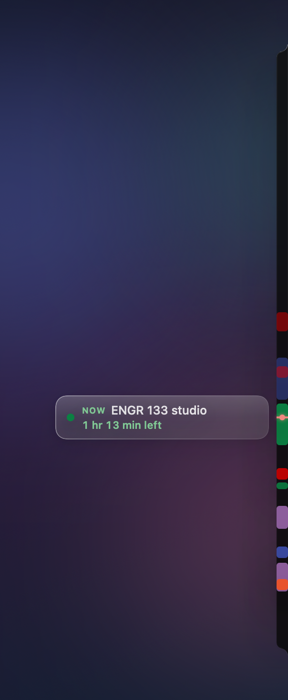
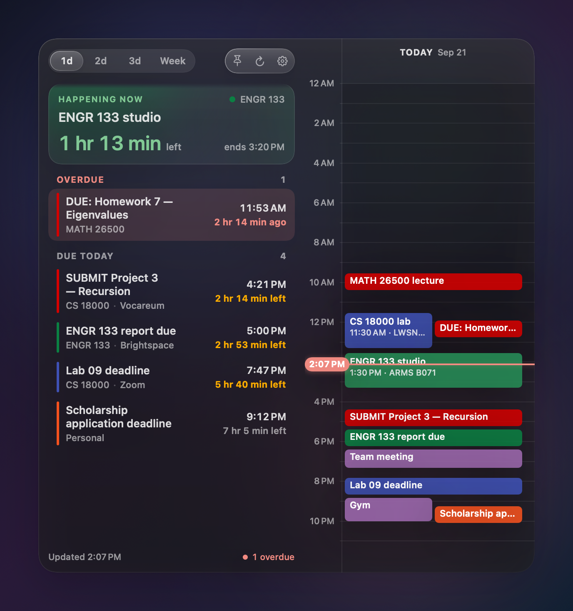
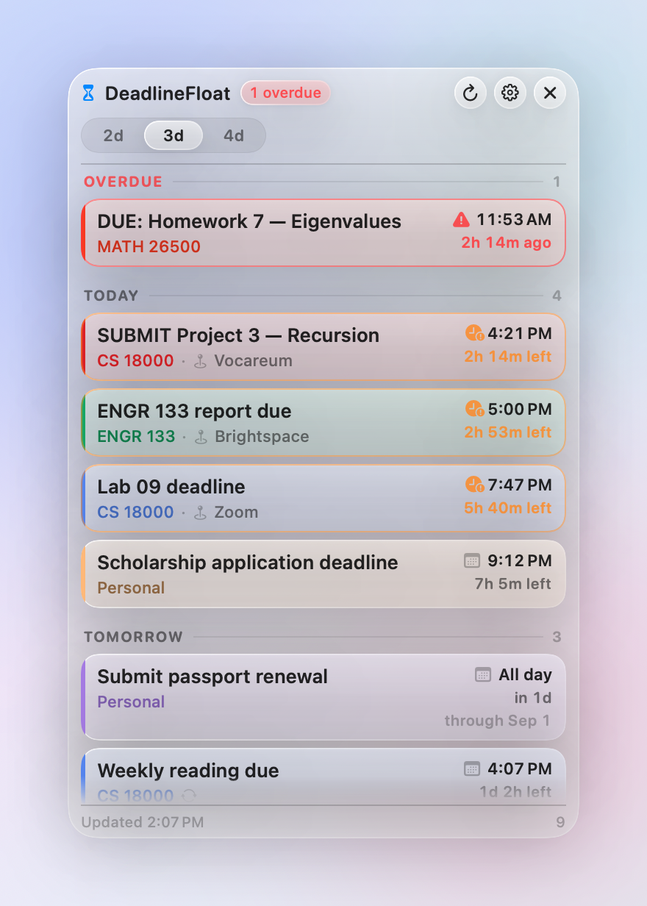
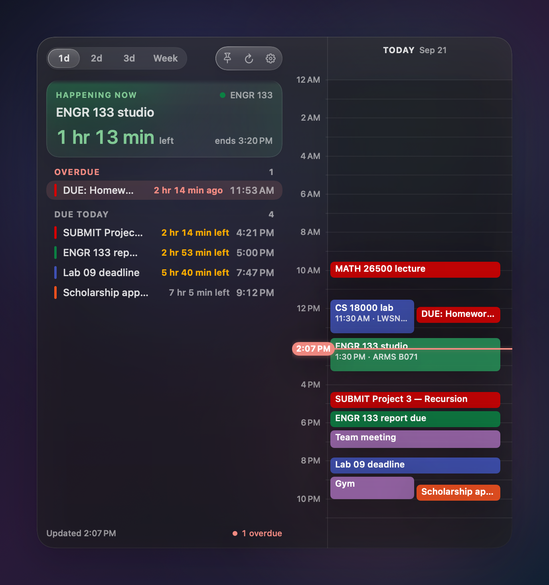
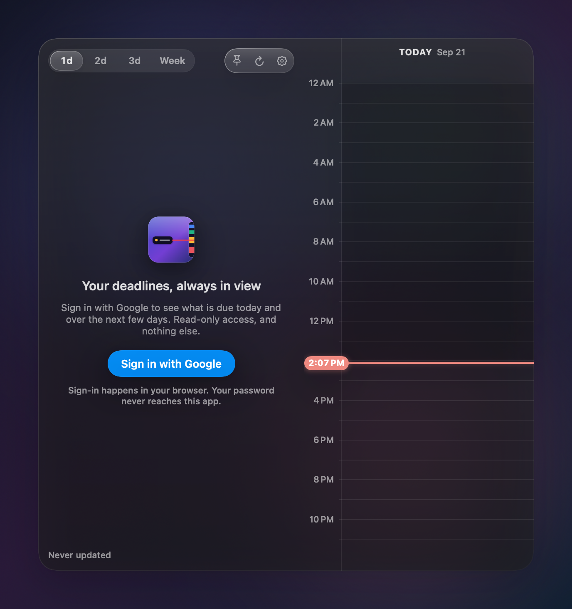
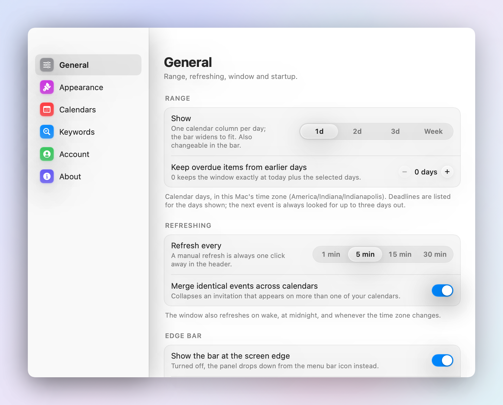
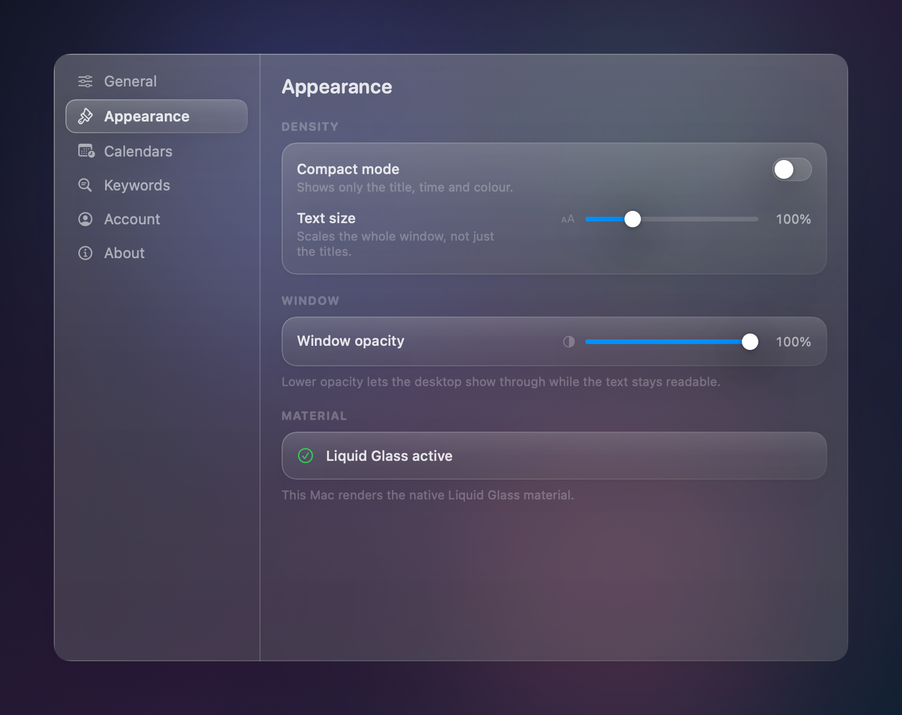
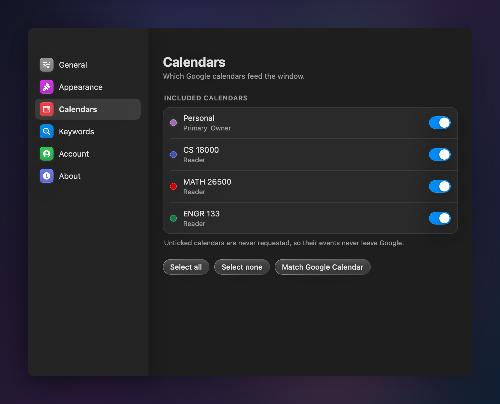

# DeadlineFloat

A bar down the edge of your Mac's screen, and an hourglass in the menu bar, for
the Google Calendar deadlines you actually have to do something about — what is
due today and when, what your day looks like, and the days after.

**[Download DeadlineFloat 1.1 →](https://github.com/21J3phy/deadlinefloat/releases/latest)**  ·  [website](https://deadlinefloat.vercel.app/)

Signed with a Developer ID certificate, notarised by Apple and stapled, so it
opens on any Mac running macOS 14 or later without a Gatekeeper warning.

Native Swift and SwiftUI, no Electron. Liquid Glass on macOS 26 and later, with a
hand-built glass fallback down to macOS 14. At rest the bar is a 12-point sliver
down the screen edge: the day as a ruler with every event drawn as long as it
lasts, a needle for now, and what is on — or next — floating beside it with a
live countdown. Rest the pointer on it, or click the hourglass, and the panel
slides out: the tasks on the left, the calendar on the right, one column per
day for one, two, three days or the week. Drag a block to move an event, or
pull an edge to change how long it lasts, and it is written straight back to
Google. Sign in with Google, tokens in the Keychain, and no network
destination other than Google's own endpoints.

| At rest | One day | Three days | Compact rows |
|---|---|---|---|
|  |  |  |  |

| First run | Settings — General | Settings — Appearance | Settings — Calendars |
|---|---|---|---|
|  |  |  |  |

> These images are rendered by the app itself (`--render-screenshots`) over a
> synthetic desktop, using its real views, type and colours. The live Liquid
> Glass material refracts whatever is genuinely behind the panel, which an
> offscreen render cannot reproduce, so the previews show the layered
> compatibility glass. Everything else is exactly what the app draws.

---

## Contents

**Using it**
- [Install and sign in](#install-and-sign-in)
- [The bar](#the-bar)
- [Launch at Login](#launch-at-login)
- [How it decides what is a deadline](#how-it-decides-what-is-a-deadline)
- [How the date range works](#how-the-date-range-works)
- [Colours](#colours)
- [Privacy and permissions](#privacy-and-permissions)
- [Troubleshooting](#troubleshooting)

**Building and shipping it**
- [Build and run](#build-and-run)
- [The Google OAuth client](#the-google-oauth-client)
- [Build a signed `.app`](#build-a-signed-app)
- [Shipping it to other people](#shipping-it-to-other-people)
- [Project structure](#project-structure)
- [Tests](#tests)
- [Edge cases it handles on purpose](#edge-cases-it-handles-on-purpose)

---

## Install and sign in

1. Drag **DeadlineFloat.app** to `/Applications` and open it. A sliver appears
   down the right edge of each display and an hourglass in the menu bar; rest
   the pointer on the sliver, or click the hourglass, to open the bar.
2. Press **Sign in with Google**.
3. Your browser opens Google's sign-in page. DeadlineFloat never sees your
   password — the browser does the signing in.
4. Google asks to allow one thing: *"See and download any calendar you can access
   using your Google Calendar."* That is the whole request. Press **Continue**.
5. The browser lands on a small confirmation page served by DeadlineFloat's own
   loopback listener, which shuts down immediately. Close the tab.

That is the entire setup. There is nothing to paste and no account to create.

The bar fills in straight away. Pick which calendars to include in
**Settings → Calendars**; until you choose, DeadlineFloat follows whichever
calendars are ticked in Google Calendar itself.

There is no Dock icon by design — the app lives as the **hourglass in the menu
bar**. Left-click opens the bar (or closes it); right-click gives Open/Close,
Refresh, Settings, Launch at Login and Quit. The overdue count appears beside
the icon when there is one, and **Settings → General → Menu bar** can add the
countdown (`in 2 hr 14 min`, or `42 min left` while something is on).

### The bar

**At rest** the bar is a 12-point sliver of dark glass on every display, spanning the
visible height: rounded on its inner side and flaring into the screen edge
with reverse-radius fillets at top and bottom, so it reads as the display's
bezel reaching into the screen. It is the day as a
ruler: midnight at the top, midnight at the bottom — so an 11:59 PM
deadline sits at the very bottom — a red
needle marking now, and every event as a block of its Google colour — the
same colour as on the calendar — as long as the event lasts and the full width
of the strip. Nothing else is drawn on it. Completed and past events are
dimmed and the event in focus is the brightest thing on it. That event also floats beside the sliver, level
with the needle, as a pill: **NOW** with how long it has left, or **NEXT** (or
**DUE**) with how long until it. Nothing on the sliver ever moves or pulses.

**To open it,** rest the pointer on the sliver or the pill for a quarter of a
second (a fling to the edge or a pass across it does nothing), or click the
hourglass in the menu bar. The sliver stretches sideways into the panel: the
strip widens from the screen edge until it is the sheet, each block on it
widens into its block on today's column of the calendar, and the tasks and
the rest of the calendar fade in inside the sheet as it grows. Closing runs the same stretch
backwards. If the bar is already open on hover, the hourglass pins it; if it
is pinned, the hourglass closes it.

On the left are the tasks:

1. The **now / next card** — *HAPPENING NOW* with the event you are in and how
   long it has **left**, or *UP NEXT* (or *DUE NEXT* for a deadline) with what
   is coming and how long until it, worded so the countdown is never ambiguous.
   Countdowns are whole minutes in words — `1 hr 12 min` — never seconds.
2. **Overdue** and **Due today** — the deadlines, each with its time and how
   long is left.
3. **Due tomorrow** and the days after, when the range includes them, and the
   completed drawer above it all.

On the right is the calendar: one column per day, each running midnight to midnight,
every event a solid block of its Google colour — dark text on the light
colours, white on the rest, as Google Calendar does it — as tall as it is long,
side by side when two genuinely overlap and nudged apart when they merely sit
close. All-day items sit in the column's header, today's column shades the
hours already gone, the event in focus is lifted a little brighter, and a red
needle with the time in a bubble runs across the grid at now.
Hovering a task row lights its block, and vice versa. The open bar lays a dark
scrim over its glass (a pale one in light mode) so all of this stays legible
whatever is behind it.

The **1d / 2d / 3d / Week** control sets how many days you see: the calendar
gains a column per day and the bar widens to fit, and the tasks list shows the
deadlines due within those days. The event in focus is always looked for up to
three days out, so the pill never goes empty on a quiet evening.

It closes a third of a second after the pointer leaves, stays open while a
menu or text field is in use, and a click on the sliver, the pill or the
hourglass pins it; the pin button, `Esc`, or a click elsewhere lets it go.
**Settings → General → Edge bar** picks the left or right edge (on a display
whose Dock is on that edge the bar uses the other one), or turns the sliver
off altogether, in which case the hourglass drops the same panel down from the
menu bar instead. **Settings → Appearance** sets how wide the sliver is (8 to
40 points) and can run each event's title along its block, top to bottom like
a spine, on blocks long enough to carry it.

### Launch at Login

1. The app must be in `/Applications`. macOS will not register a login item for
   an app running out of a build directory.
2. **Settings → General → Startup → Launch at Login**, or the same item in the
   menu-bar menu.

This uses `SMAppService` — no helper app, no `launchd` plist, nothing left behind
if you delete the app. If macOS reports **Needs approval in System Settings**,
press the button below the toggle to jump to **System Settings → General → Login
Items**.

---

## Build and run

### Requirements

- macOS 14 Sonoma or later (Liquid Glass activates automatically on macOS 26+)
- Xcode 16 or later (built and tested with Xcode 26.6 / Swift 6.3)

### In Xcode

```bash
open DeadlineFloat.xcodeproj
```

Select the **DeadlineFloat** scheme and press ⌘R.

The project is signed with team `GK2Z5G7FG9`. If that is not your team, change
**Signing & Capabilities → Team** on both targets, or set `DEVELOPMENT_TEAM` in
`Tools/generate_project.py` and regenerate. A team is needed because the app is
sandboxed and stores tokens in the Keychain; ad-hoc signing works but gives you a
new Keychain identity on every build, so you would re-authorise constantly.

### From the terminal

```bash
xcodebuild -project DeadlineFloat.xcodeproj -scheme DeadlineFloat -configuration Debug build
```

```bash
Tools/run_tests.sh
```

### Regenerating the project file

The `.xcodeproj` is generated from the file tree, so adding a source file never
means hand-editing a `project.pbxproj`:

```bash
python3 Tools/generate_project.py
```

### Demo mode

To see the interface without a Google account:

```bash
/Applications/DeadlineFloat.app/Contents/MacOS/DeadlineFloat --demo
```

`--settings`, optionally followed by a pane name (`general`, `appearance`,
`calendars`, `keywords`, `account`, `about`), opens the settings window at
launch: `open -a DeadlineFloat --args --settings account`. `--open` starts
with the bar already stretched open and pinned; add `--close-after 2` to have
it close again two seconds later, which is how the close animation gets
filmed, since no script can hover.

Demo mode uses fabricated deadlines, an in-memory token store and its own
`UserDefaults` domain. It never touches the Keychain, your real settings, or the
network.

---

## The Google OAuth client

**Users never see this.** A released build carries its own OAuth client, which is
why signing in is one button. This section is for whoever builds and releases the
app.

An installed application cannot avoid having a client ID — OAuth requires the app
to identify itself — but it does not have to be a *user's* problem. Google states
plainly that the client ID and secret issued to a desktop client "are not treated
as secrets", because they are embedded in software users already have. What
protects the flow is PKCE, plus the fact that the authorization code is only ever
delivered to a loopback listener on the user's own machine.

### Creating one

There is **no CLI or API for creating a Desktop OAuth client** — `gcloud` can
enable the Calendar API, and `gcloud alpha iap oauth-clients` exists but only
creates *Web* clients, which will not work here. It has to be done in the Cloud
Console UI.

**[`Documentation/CODEX_PROMPT.md`](Documentation/CODEX_PROMPT.md)** is a complete,
self-contained brief you can hand to Codex or any agent with browser access: it
creates the project, enables the API, configures the consent screen with the
single `calendar.readonly` scope, creates the Desktop client, and reports back on
what verification would still require.

To do it by hand instead, follow the same document — the steps are the steps.

### Where the credentials live

**Not in this repository.** `GoogleClientConfig.bundled` is deliberately empty
here. The real client lives in `Secrets/GoogleOAuth.plist`, which is git-ignored:

```bash
cp Secrets/GoogleOAuth.plist.example Secrets/GoogleOAuth.plist
# then fill in ClientID and ClientSecret
```

`Tools/build_release.sh` copies that file into the built app bundle and re-signs,
reusing the same identity and entitlements the build used — so a released build
signs in with one button while the credentials never appear in public source.
The script refuses to package a release if the file is missing a client ID or a
secret.

The reason for the indirection is specific: GitHub's secret scanning detects the
`GOCSPX-` pattern and reports it to Google, and a provider-side revocation would
break sign-in for every copy of the app at once. Keeping it out of the tree
removes that failure mode entirely.

**For everyday development you need none of this.** Run the app and put your own
client into **Settings → Account → Advanced**; it takes effect immediately, with
no rebuild. Resolution order is: that override → a `GoogleOAuth.plist` in the
bundle → the (empty) compiled-in constant.

---

## Build a signed `.app`

```bash
Tools/build_release.sh            # build, sign, notarise, staple, package
Tools/build_release.sh --no-notarize   # skip the round trip to Apple
Tools/build_release.sh --no-dmg        # zip only
```

One command takes the source to something a stranger can download and open. It

1. builds Release as a universal binary (arm64 + x86_64), signed with the
   **Developer ID Application** certificate it finds in the keychain;
2. copies `Secrets/GoogleOAuth.plist` into the bundle and re-signs, from the
   checked-in entitlements file rather than the `.xcent` the build leaves
   behind — see below;
3. checks the signature has the hardened runtime, a secure timestamp and no
   `get-task-allow`, and refuses to continue if any of those is wrong;
4. zips it, notarises it, staples the ticket, and rebuilds the zip from the
   stapled bundle;
5. builds the disk image, **signs the image too**, notarises and staples that;
6. asks Gatekeeper the same question a user's Mac will ask, and writes
   `build/SHA256SUMS.txt`.

The app is sandboxed and holds three entitlements: `app-sandbox`,
`network.client` (Google's HTTPS endpoints) and `network.server` (the loopback
listener used for the few seconds of the OAuth redirect).

> **Why not the `.xcent`.** An ordinary (non-archive) Release build injects
> `com.apple.security.get-task-allow`, the entitlement that lets any process
> attach a debugger. Re-signing from the build's own entitlements file would
> ship that, and a debuggable app is one whose OAuth tokens can be read out of
> memory. The build passes `CODE_SIGN_INJECT_BASE_ENTITLEMENTS=NO` and signs
> from `DeadlineFloat/DeadlineFloat.entitlements`, then checks the result.

> **Why the disk image is signed as well as notarised.** A stapled ticket on an
> unsigned image leaves Gatekeeper nothing to evaluate:
> `spctl --assess --type open --context context:primary-signature` answers
> *rejected: no usable signature*. The image is the file people actually
> download, so it gets a signature of its own.

To sign with a different identity or team:

```bash
DEADLINEFLOAT_TEAM=ABCDE12345 Tools/build_release.sh

DEADLINEFLOAT_IDENTITY="Developer ID Application: Your Name (ABCDE12345)" \
  Tools/build_release.sh
```

Then point the website's download block at the artefacts:

```bash
Tools/update_download.sh          # version, size and checksums, from build/
```

It refuses to run if the disk image carries no notarisation ticket, so the page
cannot advertise a download that will not open.

To regenerate the previews in this README:

```bash
Tools/make_screenshots.sh
```

To redraw the app icon and the disk image backdrop:

```bash
swift Tools/make_icon.swift DeadlineFloat/Assets.xcassets/AppIcon.appiconset
swift Tools/make_dmg_background.swift build/dmg-background
```

---

## Shipping it to other people

All of this is done. It is written down because it is the part that is easy to
get subtly wrong, and because the credentials it depends on live only on one
Mac.

### Where things live

| | |
|---|---|
| Source | `21J3phy/deadlinefloat-app` — **private** |
| Website and releases | [`21J3phy/deadlinefloat`](https://github.com/21J3phy/deadlinefloat) — public, Pages from `main` at `/docs` |
| Root of the host | [`21J3phy/21J3phy.github.io`](https://github.com/21J3phy/21J3phy.github.io) — public; exists so the whole host can be verified, not just a path |
| Vercel | `deadlinefloat.vercel.app` — the URL on Google's consent screen |
| Download | <https://github.com/21J3phy/deadlinefloat/releases> |

The split is deliberate. The site, the privacy policy and the downloads have to
stay public, because Google's OAuth configuration and Search Console are
pointed at them. The source does not have to be public, so it is not.

The site is served from two places: GitHub Pages at
<https://21j3phy.github.io/deadlinefloat/> and Vercel at
<https://deadlinefloat.vercel.app/>. The Vercel one is what the Google consent
screen now links to.

### 1 · Signing and notarisation — done

A **Developer ID Application** certificate exists for team `GK2Z5G7FG9`
(created 21 September 2026, G2 Sub-CA, expires 17 September 2031). Apple only
issues these to the *Account Holder* — an App Store Connect API key cannot, it
answers `403 This operation can only be performed by the Account Holder` — so it
has to be made in the browser at
<https://developer.apple.com/account/resources/certificates/add>.

Notarisation runs from a keychain profile called `deadlinefloat`, holding an App
Store Connect API key. Both, and how to restore them onto another Mac, are in
`Secrets/SIGNING.md` — git-ignored, on this machine only. **A lost Developer ID
private key cannot be recovered and Apple allows only a handful of these
certificates per account, so keep a backup off this Mac.**

`Tools/build_release.sh` does the rest. A released build reports:

```
build/Release/DeadlineFloat.app: accepted
source=Notarized Developer ID
```

### 2 · Google OAuth publishing — done

The consent screen is **In production** (published 21 September 2026), so refresh
tokens no longer expire after seven days.

### 3 · Google verification — submitted, under review

`calendar.readonly` is one of Google's **sensitive** scopes — sensitive, not
*restricted*, so no third-party security assessment is involved.
`calendar.events`, which *Settings → Account → Moving events* adds, is
sensitive too, so the tier does not change; but it is a **second scope on the
consent screen**, and the consent screen must list it before Google will issue
it. Add it to the OAuth consent screen in the Cloud console alongside the
read-only one, and expect the verification submission to have to be updated to
match. A published but unverified app still works, with two consequences:

- a **"Google hasn't verified this app"** interstitial on first sign-in, which
  the user clears with *Advanced → Go to DeadlineFloat*;
- a **100-user cap** that applies over the lifetime of the project and
  **cannot be reset or raised** without verification.

Data-access verification requires verified branding first, and branding
verification is an **automated check that answers in under a minute**. It has
returned the same thing for both domains the site has been served from:

> The website of your home page URL "…" is not registered to you.

That is not a stale message and not a propagation delay. Both hosts were
verified in Google Search Console with `niravsurabhi@gmail.com` as **Owner**
before the check ran, both were registered as the authorised domain, and the
second was retried five minutes later:

| Home page tried | Search Console | Result |
|---|---|---|
| `https://21j3phy.github.io/deadlinefloat/` | Owner, verified (HTML file) | not registered to you |
| `https://deadlinefloat.vercel.app/` | Owner, verified (HTML file) | not registered to you |

Both `github.io` and `vercel.app` are on the [Public Suffix
List](https://publicsuffix.org): every name under them is a shared sub-domain
rather than one anyone registers. The consistent reading is that Google's check
wants a domain you actually registered, and that no free hosting sub-domain will
pass it however thoroughly Search Console verifies the same URL.

Rather than buy a domain on a guess, the console's other option was taken —
*I believe the issues found are incorrect → Request additional review*, which
routes to Google's **Third Party Data Safety Team**, stated as 2–3 business
days. The console shows no pending indicator, so the reply will arrive by email
to `niravsurabhi@gmail.com`.

**If that review confirms the automated finding**, the fix is a registrable
domain: buy one, point it at the Vercel deployment, re-verify it in Search
Console, and change the two Branding URLs plus the authorised domain to match.
Everything else on the Branding page is already accepted — the logo objection
cleared once the icon stopped being Apple's `hourglass` SF Symbol and became a
drawing of the app.

Under 100 users none of this blocks anything.

### 4 · Google sign-in branding

The sign-in button reads "Sign in with Google" with no logo, because Google's
branding guidelines want their own supplied asset rather than a redrawn one.
Drop Google's official mark into `Assets.xcassets` as an image set named
**GoogleLogo** and it appears in the button automatically — no code change.

### Shared quota

All users of a released build share your Cloud project's Calendar API quota. The
default is generous relative to what this app does — a handful of `GET`s per user
every five minutes, plus one `PATCH` whenever a block is dragged — but it is
worth knowing the meter is yours.

---

## How it decides what is a deadline

An event is a deadline when its title matches any **include** rule and no
**exclude** rule. Both lists are editable in **Settings → Keywords**.

**Included by default**

| Rule | Matches |
|---|---|
| Starts with `DUE` | `DUE: Homework 7`, `🔴 DUE: Lab 3`, `[DUE] Essay` |
| Contains `deadline` | `Scholarship application deadline` |
| Contains `due` | `Lab 09 is due tonight`, `Essay (due)` |
| Starts with `SUBMIT` | `SUBMIT Project 3` |

**Excluded by default:** titles starting with `DONE`, `CANCELLED` or `MISSED`.
Exclusions always win — including when *Show all calendar events* is on, so a
`DONE …` event stays hidden either way.

Matching details:

- Case- and accent-insensitive throughout.
- *Starts with* skips leading emoji, brackets and punctuation, so
  `🔴 DUE: Lab 3` and `***SUBMIT*** portfolio` both match.
- **Match whole words only** (on by default) stops `due` firing on `residue` or
  `subdued`, and stops `DUE` firing on `Duel Club`. Turn it off in Settings for
  plain substring matching.
- Events you have declined are hidden by default; cancelled events always are.
- **Show all calendar events** turns the include list off entirely and lists
  everything in range.

---

## How the date range works

The **1d / 2d / 3d / Week** control picks today alone, or today plus one, two
or six more calendar days; the default is one day and the choice survives
relaunch. The window runs from local midnight this morning to local midnight
*N* days later, in this Mac's time zone.

All the arithmetic goes through `Calendar`, never `now + n × 86400`, so the
window stays honest across daylight saving: on the day the clocks spring forward
it is 23 hours long, and 25 on the day they fall back. There are tests for both,
pinned to `America/Indiana/Indianapolis`.

What is happening now — or, when nothing is, the next event to start — is
lifted out as the card at the top of the tasks, with a countdown in whole
minutes (`1 hr 13 min left` while it is on; `in 2 hr 14 min` before it
starts; `2 days 3 hr` beyond a day). Every event on the calendar
counts, not only deadlines; a deadline coming up says *DUE NEXT*. The moment
an event ends the card moves to the next one. **Settings → Appearance** turns
the card off if you would rather have the plain list.

The rest are grouped into **Overdue**, **Due today**, **Due tomorrow**, and
then one section per remaining day titled with the weekday and date
(`Friday · Sep 4`). Empty sections are not drawn. Within each section the
order is chronological, with all-day items at the top of their day and a stable
tie-break so the list never reshuffles on refresh. The clock advances on the
minute, and additionally at the exact moment any visible deadline passes or
comes within six hours, so a row never lingers in the wrong section.

**Settings → General** adds an optional look-back that keeps overdue items from
earlier days visible. It defaults to `0`, which is the literal "today plus N
days" window.

### Which hours a day shows

Each column, and the sliver, runs midnight to midnight by default: nothing is
left out and 3 AM is where 3 AM is. Most days are not twenty-four hours long
though, and the small hours spend a third of the height on nothing. **Settings
→ General → Hours** sets where the day starts and ends — `7 AM` to `1 AM`, say,
or `9 AM` to `6 PM`. The same height over fewer hours makes every block taller,
easier to read, and easier to take hold of. Six hours is the shortest a day can
be; ask for less and the end is pushed out rather than the choice refused.

An end at or before the start means the next morning, so a day can run through
midnight. When it does, the small hours belong to the night before: at 00:30 on
a `7 AM – 1 AM` day the bar is still showing Wednesday.

**Shortening the day hides nothing.** Every instant still belongs to exactly
one day — there is a test that walks a whole week in half hours and checks that
each one is claimed by one column and no more — and an event outside the hours
shown is drawn pinned to whichever end of its own column it fell off, as well
as appearing in the list, the countdown and the menu bar as it always did.

Clicking a row, a block on the timeline, or the spotlight opens that event in
Google Calendar in your default browser. Right-click for **Mark as Done**,
**Copy Link** and **Copy Title**.

### Marking things done

Swipe a row sideways with two fingers — either direction — and it is done: the
row follows your fingers and uncovers a green *Done*, the trackpad taps once
you have gone far enough, and on release the deadline leaves the list.
Completion is local to this Mac — nothing about it is written to Google — and
is remembered for thirty days, long after the event has left every window the
app shows.

Completed deadlines live in a drawer *above* the list. Scroll up past the top
of the list and keep going: there is a barrier, the trackpad taps as you cross
it, and the drawer settles into view with the most recently completed item
nearest the list. Scroll back down past the barrier and the list catches at
its default position with another tap. A short pull that does not reach the
barrier springs back where it started. Swipe a completed row sideways, or
right-click it, to bring it back. (The drawer's barrier needs macOS 15; on
macOS 14 the completed section simply follows the list.)

### Moving and resizing events

Take hold of a block on the calendar and it moves: up and down for a different
time, sideways for a different day. Take hold of its top or bottom edge — the
pointer becomes a resize cursor and a small grip appears — and that edge moves
on its own, so the event starts later or runs longer while the other end stays
where it is. A block being dragged lifts clear of the day's layout, carries the
time it is proposing on a capsule, and drops on a five-minute grid; hold **⌥**
for the minute. Nothing is shorter than five minutes, and nothing leaves the
column it was dropped on.

A press that does not travel is still a click, and still opens the event in
Google Calendar. Blocks that have no length on the grid — all-day items, which
live in the column header — cannot be dragged. A recurring event arrives
already expanded, so dragging one occurrence moves that occurrence, exactly as
it does in Google Calendar.

The new time is drawn the instant you let go and written to Google behind it,
with `sendUpdates=none` so nudging your own calendar does not mail everyone
invited. If Google refuses — a calendar you can only read, an event somebody
else owns, no network — the block goes back where it came from and the footer
says why. **Undo Move** is in the right-click menu of the block you last moved,
and *Move 15 minutes later* and friends are accessibility actions on every
block, so none of this needs a mouse.

It is off until you ask for it, because it is the one feature that changes what
Google is asked to allow. **Settings → Account → Moving events** turns it on;
the extra permission is granted at sign-in, so the switch asks you to reconnect
once. If you run your own Cloud project, add `.../auth/calendar.events` to the
OAuth consent screen *before* reconnecting — a scope the consent screen does
not list is refused at sign-in rather than quietly downgraded.

---

## Colours

Everything is drawn in the colour Google Calendar itself shows, resolved the
way Google Calendar resolves it:

1. the event's own `colorId`;
2. otherwise the parent calendar's `colorId`, or its `backgroundColor`;
3. otherwise a neutral blue.

There is a wrinkle here worth knowing. The Calendar API still reports its
original 2010 palette — Tomato as `#dc2127`, Basil as `#16a765` — and
`GET /colors` returns the same, while Google Calendar on the web and on phones
has drawn the newer Material palette since 2018: Tomato is `#D50000`, Basil
`#0B8043`. Using the API's values verbatim looks *nothing* like your calendar.
So every preset is translated, by id when one is given and by hex otherwise,
to the colour Google Calendar shows (`Domain/GooglePalette.swift` holds both
tables). A calendar with a custom colour you picked yourself is not a preset
and is used exactly as reported. The live palette is fetched on first sync,
refreshed every 24 hours, and consulted only for an id neither built-in table
knows.

**Urgency never changes that colour.** The capsule bar down the leading edge of
each row, the block on the calendar and the segment on the sliver are all the
unmodified Google colour, and the card carries it as a dot and as a soft glow.
Urgency is carried by the wording and colour of the countdown — `2 hr 14 min
left` in amber inside six hours, `2 hr 14 min ago` in red once it has passed —
and overdue rows sit on a faint red wash. There is a test asserting that the same event resolves to the same colour
whether it is overdue, imminent or days away.

Text in the task list is never tinted with a Google colour. The bar is glass
over whatever happens to be behind it, and a coloured label that reads well
over a dark wallpaper vanishes over a white document; monochrome text keeps
its contrast on any backdrop. Urgency uses Google Calendar's own text colours
— its red and green 700 in light mode, its red and green 300 in dark, its
yellow 600 for amber — each clearing 4.5:1 on the panel. The app honours
**Increase contrast** and **Reduce transparency** in System Settings — the
latter turns the glass into a solid window background.

---

## Privacy and permissions

Full policy: [`Documentation/PRIVACY.md`](Documentation/PRIVACY.md). In short:

- **One scope, or two.** `https://www.googleapis.com/auth/calendar.readonly`
  always. `https://www.googleapis.com/auth/calendar.events` as well when
  *Settings → Account → Moving events* is on, which is what lets a block be
  dragged. No profile, no email, no `userinfo`. The account address shown in
  Settings is the id of your primary calendar, which arrives with the calendar
  list — no extra permission needed for it.
- **Almost read-only, structurally.** Every request to `www.googleapis.com`
  must be a `GET`, with exactly one exception: a `PATCH` to one event's own
  URL, carrying nothing but its new start and end. The HTTP layer checks the
  verb *and the shape of the path* and throws on anything else before the
  request leaves the process, so the app cannot create an event, delete one, or
  touch a calendar or its sharing. Turn the setting off and the `GET` rule is
  absolute again.
- **Host allowlist.** The only reachable hosts are `oauth2.googleapis.com` and
  `www.googleapis.com`. Any other host is refused in code. There is no analytics
  endpoint to remove, because none could be reached.
- **Tokens in the Keychain**, as a single generic-password item under the app's
  bundle identifier. Never in `UserDefaults`, never on disk in the clear.
- **Local cache.** The last successful fetch is written to
  `Application Support/DeadlineFloat/snapshot.json` inside the app's sandbox
  container so the window has content the moment it opens and works offline.
  Disconnecting deletes it.
- **Unticked calendars are never requested**, so their events never leave Google.
- **Logs** carry counts and status codes only — never event titles, locations or
  calendar names.

---

## Project structure

MVVM, with the entire read path built out of pure value types so it can be tested
without a network, a Keychain or a window.

```
DeadlineFloat/
├── App/            NSApplication lifecycle: the menu bar panel, the optional
│                   edge bars (one per display) and their coordinator, the
│                   status item, the settings window, the main menu, Launch
│                   at Login, and the preview renderer
├── Models/         Google API payloads and the display-ready Deadline type
├── Domain/         Pure logic — date window, RFC 3339 parsing, deadline
│                   detection, building, de-duplication, grouping, sorting,
│                   countdowns, colour resolution
├── Services/       OAuth (PKCE + loopback), Keychain, the HTTP client that
│                   allows a GET and one event PATCH, the Calendar API client,
│                   repository, disk cache
├── Preferences/    Every setting, persisted in UserDefaults
├── ViewModels/     DeadlineListViewModel — refresh loop, clock tick, sections
├── Views/          SwiftUI: the bar, the day rail, the calendar, the pill,
│                   the task pane, the now/next card, rows, sections, the
│                   completed drawer, empty and sign-in states, the six
│                   settings panes, demo data
├── DesignSystem/   Liquid Glass surfaces and controls, type ramp, palette,
│                   motion, SF Symbol catalogue
└── Support/        Logging, app info, small extensions
```

**Where the interesting decisions live**

| Question | File |
|---|---|
| What counts as "today plus 3 days"? | `Domain/DateWindow.swift` |
| What is a deadline? | `Domain/DeadlineDetector.swift` |
| When is something overdue? | `Domain/DeadlineBuilder.swift` |
| Which colour, and why does it match Google Calendar? | `Domain/EventColorResolver.swift`, `Domain/GooglePalette.swift` |
| What is happening now, or next, and what does the countdown run to? | `Domain/ScheduleFocus.swift` |
| What is on the calendar, and which of it is a deadline? | `Domain/DeadlineAssembler.swift` |
| What stretch of the day is the ruler, and which day is it now? | `Domain/RulerSpan.swift` |
| Why are two events half an hour apart both readable? | `Domain/TimelineLayout.swift` |
| How does hovering open and close the bar? | `App/EdgeBarController.swift` |
| How does the menu bar panel drop down and close? | `App/MenuBarPanelController.swift` |
| Where does a scroll come to rest, and when does the trackpad tap? | `Domain/DrawerDetents.swift` |
| How does a two-finger swipe become a completion? | `Domain/SwipeRecognizer.swift`, `App/SwipeGestureMonitor.swift` |
| Why can't this app write to my calendar? | `Services/HTTPClient.swift` |
| Where does the client ID come from? | `Services/GoogleClientConfig.swift` |
| How does the glass work on macOS 14? | `DesignSystem/Glass.swift` |
| Why doesn't clicking the panel steal focus? | `App/EdgeBarPanel.swift` |

**The bar.** Two borderless, non-activating `NSPanel`s per display, both
`level = .floating` with `[.canJoinAllSpaces, .fullScreenAuxiliary]`: one is
exactly the sliver's width when collapsed — so the rest of the screen stays
clickable — and grows to the full panel; the other is the pill. Neither ever
takes focus from what you are working in. A tracking area reports the pointer
entering and leaving; a dwell opens the bar and a grace period closes it.
`EdgeBarCoordinator` keeps one pair per display and rebuilds the set when
displays come and go. With the sliver turned off, the same content drops down
from the status item in a panel at `.popUpMenu` level that a global and a
local mouse monitor close on a click anywhere outside.

**The glass.** On macOS 26 and later the SwiftUI content lives inside an
`NSGlassEffectView` and controls use `glassEffect(_:in:)`, `GlassEffectContainer`
and interactive `Glass` — the real system material. On macOS 14 and 15 the same
shapes are drawn as a layered approximation: always-active `NSVisualEffectView`,
vertical sheen, specular rim and shadow. Glass is reserved for the control
layer — the range control, the header capsule, chips and buttons. Rows and the
spotlight sit directly on the window material, which is what keeps the panel
reading as one object rather than a stack of tinted boxes. Switches, steppers,
sliders and the segmented control are drawn in SwiftUI rather than AppKit so
the settings window shares the same language.

---

## Tests

```bash
Tools/run_tests.sh
```

**271 tests, all passing.** They cover:

| Area | File |
|---|---|
| Date boundaries, DST, noon vs midnight | `DateWindowTests`, `GoogleDateTests` |
| Sorting and grouping | `GroupingSortingTests` |
| Deadline filtering | `DeadlineDetectorTests` |
| Countdowns, the card's clock, section and footer text | `CountdownFormatterTests`, `SpotlightTests` |
| What is happening now, or next | `CompletionTests` (`ScheduleFocusTests`) |
| Completion, the drawer's detents, swipe recognition | `CompletionTests` |
| The day's span, which day is current, the hour labels | `RulerTests` |
| The calendar's events: every event, exclusions, which are deadlines | `CompletionTests` (`AgendaTests`) |
| Recurrence | `RecurrenceTests` |
| Colour selection | `EventColorTests`, `RGBColorTests` |
| Building deadlines from events | `DeadlineBuilderTests` |
| Duplicates across calendars | `DuplicateReducerTests` |
| The whole read pipeline | `DeadlineAssemblerTests` |
| Google JSON decoding | `GoogleDecodingTests` |
| Method and path guard, allowlist, backoff | `HTTPClientTests` |
| Dragging an event to a new time | `EventEditTests` |
| The hours a day shows, and that none are lost | `DaySpanTests` |
| PKCE, auth URL, token expiry, loopback | `OAuthTests` |
| OAuth client resolution and validation | `GoogleClientConfigTests` |
| Settings persistence and clamping | `PreferencesTests` |
| Offline cache | `SnapshotCacheTests` |
| Error → UI state mapping | `RepositoryAndStateTests` |
| Every SF Symbol resolves | `SymbolAvailabilityTests` |

Nothing in the suite touches the network, the Keychain or a Google account. Unit
tests are hosted by the app, which detects XCTest at launch and skips creating
windows, timers and the status item.

---

## Edge cases it handles on purpose

| Case | Behaviour |
|---|---|
| **Noon vs midnight** | Parsed from the RFC 3339 offset and rendered in your locale's 12- or 24-hour format. `12:00 PM` and `12:00 AM` are twelve hours apart, and tested. |
| **Due exactly at 12:00 AM** | Filed on the day the calendar says it falls on, and included at the very start of the window rather than falling off the edge. |
| **All-day events** | Say `All day` — no time is invented. They sort to the top of their day and only become overdue once the day is over. Multi-day spans keep Google's exclusive end date and show `through Sep 5`; one in progress is filed under today rather than a day already out of range. |
| **Recurring events** | Fetched with `singleEvents=true`, so each instance carries its own start. Instances keep their wall-clock time across a DST change, moved occurrences follow their new time, and cancelled occurrences disappear. |
| **Daylight saving** | Every date calculation goes through `Calendar`. The window is 23 hours on spring-forward day and 25 on fall-back day, and countdowns reflect the real elapsed time. |
| **Offline** | The last successful fetch is shown with an `Offline` chip, and the footer keeps reporting when that data is from. |
| **Expired Google auth** | A revoked or expired refresh token is detected, the dead token is dropped instead of being retried forever, and the footer offers **Reconnect**. |
| **Rate limits** | `429`, and `403` carrying a rate-limit reason, are retried with exponential backoff and full jitter, honouring `Retry-After`. Past that a `Google is rate limiting` chip appears and cached data stays on screen. |
| **Events edited while running** | A refresh every five minutes (configurable), a manual refresh in the header, and an immediate refresh on wake from sleep, day rollover, time-zone change and clock change. |
| **Duplicates across calendars** | An invitation on two of your calendars merges into one row, marked with the other calendar's name; two genuinely different events that merely look alike stay as two rows, told apart by the calendar name. |
| **A calendar fails, the rest don't** | That calendar falls back to its cached events and the others still refresh. Only an authentication failure stops the whole sync. |
| **Display unplugged** | A saved window frame that no longer lands on a screen is brought back onto one, keeping its size. |

---

## Troubleshooting

**"This build is not signed in to Google."** The build has no OAuth client ID
compiled in — see [The Google OAuth client](#the-google-oauth-client). Users of a
released build never see this.

**"Google hasn't verified this app."** Expected until OAuth verification is
complete. Press **Advanced → Go to DeadlineFloat (unsafe)**.

**`Error 403: access_denied`** — the consent screen is still in *Testing* and this
Google account is not on the test-user list. Add it, or publish the app.

**Signed in, but it asks again about a week later.** That is the seven-day
refresh-token expiry for OAuth clients in *Testing* status. Publish the app to
stop it.

**`Error 400: redirect_uri_mismatch`** — the OAuth client is a *Web application*
rather than a *Desktop app*. Recreate it with the right type.

**The bar does not appear.** Press ⌘W or click the hourglass in the menu bar.
If the menu bar is crowded, macOS may have hidden the icon; widen the menu bar
or remove another item. The sliver sits on the right edge of every display
unless the Dock is there, in which case it uses the left.

**Launch at Login says "Unavailable for this build".** Move the app to
`/Applications` and try again.

**No deadlines, but the calendar has some.** Check **Settings → Calendars** (the
calendar may not be ticked) and **Settings → Keywords** (the title may not match
any rule). Turning on **Show all calendar events** for a moment will tell you
which of the two it is.

**The glass looks flat.** **Settings → Appearance** reports which material is
active. Liquid Glass needs macOS 26; below that you get the compatibility glass.
Also check that **Reduce transparency** is off in System Settings →
Accessibility → Display.
